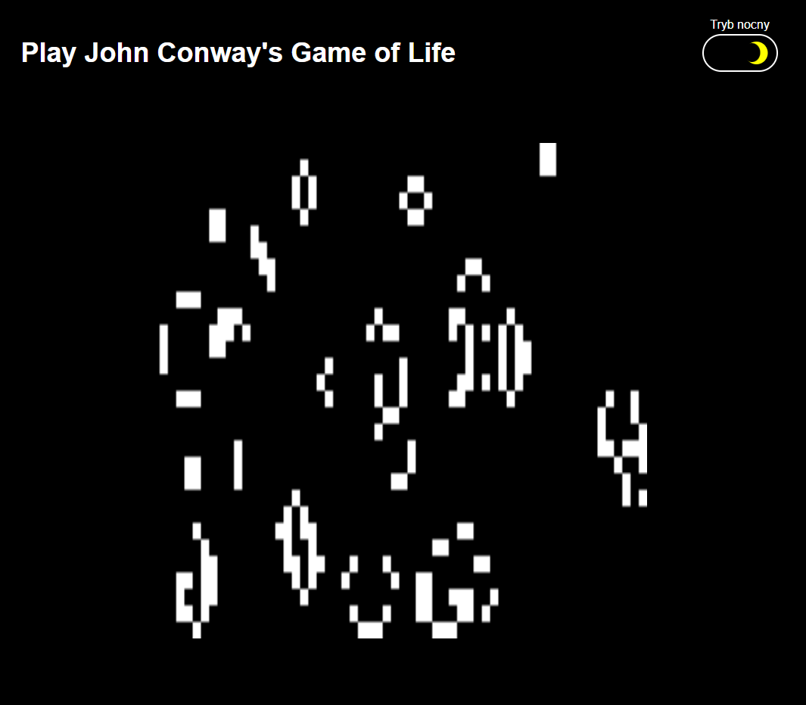

# **Game-of-life-with-night-mode**
Conway's Game of Life is one of the first and most famous examples of a mobile slot machine. Logic was created for the project created during the studies in the field of medical chemistry, as the end of a 45-hour Python language course. 

##Technical
We can run the game in light and dark mode, which I obtained using a CSS variables. I also used the localStorage to save the light or dark mode after the user visits the site. Besides, I used "prefers-color-scheme" to automatically adjust the color mode to the user set in the system. The game is displayed responsibly on devices with different resolutions and the CSS styles were written in accordance with the mobile first design method.

## Built With
* JavaScript (ES5+)
* HTML
* CSS

##Demo

https://viniski.github.io/Game-of-life-with-night-mode/

## License
This project is licensed under the MIT License
